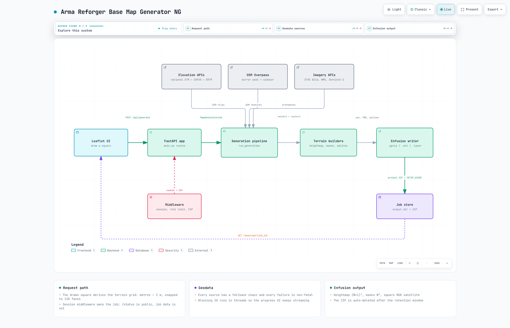

# Arma Reforger Base Map Generator

**Draw a square on a map, get an Enfusion-ready terrain package.** This tool builds realistic
terrain from real-world geodata, replacing hours of manual work in the
[Arma Reforger World Editor](https://community.bistudio.com/wiki/Arma_Reforger:World_Editor) —
sourcing elevation, painting surface masks, and placing roads one by one.

Out comes a heightmap, nine surface masks, road/water/forest splines, satellite imagery, and a
structured Enfusion project with a `SETUP_GUIDE.md` written for your specific map.


> Tested with **Arma Reforger Tools 1.8.0.10**. The generated project layout, heightmap `.asc`,
> surface masks and `.layer`/`.ent`/`.gproj` files also load in 1.7 with no format changes.

## Quick start

Needs [Docker and Docker Compose](docs/setup.md#docker-installation). Nothing else — worldwide
30 m elevation streams from AWS Open Data with no API key.

```bash
git clone https://github.com/tubalainen/arma_reforger_base_map_generator_ng.git
cd arma_reforger_base_map_generator_ng
cp .env.example .env        # optional — only needed for high-res national data
docker compose up -d
```

Open **[http://localhost:8080](http://localhost:8080)**, draw a square, name your map, hit
Generate, and download the ZIP when the pipeline finishes.

The terrain grid is derived from the square you drew — cell size is fixed at 2 m and the square
snaps to a whole number of 128-face tiles, up to 16384 x 16384 (32.8 km). There is nothing to pick.

Full walkthrough, upgrades and image tags: **[docs/setup.md](docs/setup.md)**.

## What you get

- **Elevation** — national LiDAR at 0.4–2 m for six countries, Copernicus DEM 30 m worldwide,
  with an automatic fallback chain and no API key required for the global path.
- **Heightmap** — 16-bit `.asc` and PNG, with road flattening, water levelling and bathymetry.
- **Nine surface masks** — grass, deciduous and coniferous forest floor, rock, asphalt, gravel,
  dirt, sand and water edge. Masks with no meaningful coverage are omitted from the ZIP.
- **Roads** — full OSM classification mapped to `RG_Road_*` generators, emitted as spline
  entities with country-specific surface inference where OSM is silent.
- **Water and forests** — closed splines, one per lake and one per forest polygon, ready for a
  Lake or Forest Generator prefab.
- **Buildings** — one positioned `Building_*.et` instance per OSM footprint, rotation-aligned to
  the longest wall.
- **Satellite imagery** — Sentinel-2 worldwide, Lantmäteriet orthophotos at 0.16 m/px in Sweden.
- **Multi-user ready** — per-session job isolation, rate limiting, and a live activity log.

## Supported countries

Designed around the Nordics and Baltics, which have country-specific high-resolution APIs. It
works worldwide through the global fallbacks.

| Country | Primary source | Resolution | Auth |
|---|---|---|---|
| Norway | Kartverket WCS (NHM-DTM) | 1 m | None |
| Estonia | Maa-amet WCS | 1 m | None |
| Poland | GUGiK Geoportal WCS | 1 m | None |
| Sweden | Lantmäteriet STAC Höjd | 1 m | Free account |
| Finland | NLS WCS (korkeusmalli_2m) | 2 m | Free API key |
| Denmark | Dataforsyningen WCS (DHM) | 0.4 m | Free token |
| **Everywhere else** | AWS COP30 (Copernicus Open Data) | 30 m | **None** |

Every country falls back to AWS COP30, then OpenTopography, SRTM and ALOS. Registration links,
environment variables and the Sweden-specific extras are in
**[docs/data-sources.md](docs/data-sources.md)**.

## Importing into Enfusion World Editor

The ZIP is a pre-configured Enfusion project. The high-level workflow:

1. Copy the addon folder into your Workbench addons directory
2. Open the `.gproj` — the terrain entity and world layers are already configured
3. Import `heightmap.asc` via Terrain Tools → Import Heightmap
4. Batch-import the `surface_*.png` masks via Terrain Tools → Import Surface Mask
5. Import `satellite_map.png` as the satellite texture overlay
6. Drag a Forest Generator (`FG_*`) onto each vegetation spline and a Lake Generator (`LG_*`)
   onto each water spline — roads are already wired

The **`SETUP_GUIDE.md` inside the ZIP** has exact steps with pre-computed values for your
terrain. For everything the ZIP contains, see **[docs/output-files.md](docs/output-files.md)**.

The generator follows *The Atlas 2: Arma Reforger Terrain Creation Guide* by Jakerod, the
community-standard manual workflow, for entity names, prefab paths and surface paint ordering.

## Architecture

The whole system on one page — how a drawn square becomes an Enfusion project ZIP.

[](https://htmlpreview.github.io/?https://github.com/tubalainen/arma_reforger_base_map_generator_ng/blob/main/docs/architecture.html)

**[Open the interactive diagram →](https://htmlpreview.github.io/?https://github.com/tubalainen/arma_reforger_base_map_generator_ng/blob/main/docs/architecture.html)**
(or download [`docs/architecture.html`](docs/architecture.html) — one self-contained file, no
server or build step).

Hit **Play story** to walk the three guided chapters, or **Live** to animate data flowing along
every arrow. Click any box for its upstream/downstream neighbours and a shareable deep link;
**PATH** traces a route between two components, **LENS** compares component kinds, and **Export**
gives you PNG, SVG, an animated WebM or a share card. Generated from
[`docs/architecture.archify.json`](docs/architecture.archify.json) with
[Archify](https://github.com/tt-a1i/archify) — edit that and re-render rather than touching the HTML.

## Documentation

| Guide | What's in it |
|---|---|
| [Installation & setup](docs/setup.md) | Docker on Linux and WSL2, `.env`, first map, upgrading, image tags |
| [Data sources & API keys](docs/data-sources.md) | Per-country sources, free registrations, fallback chains, Sweden extras |
| [Output files](docs/output-files.md) | Every file in the ZIP: project files, masks, GeoJSON, metadata |
| [Production deployment](docs/deployment.md) | Security settings, nginx + Cloudflare, LAN access |
| [Self-hosted OSM data](docs/local-overpass.md) | Optional local Overpass sidecar — one country, self-updating |

## Tech stack

- **Backend** — Python 3.11, FastAPI, Uvicorn
- **GIS** — GDAL, rasterio, shapely, pyproj, numpy, scipy, Pillow
- **Frontend** — Leaflet.js, Leaflet.Draw, Bootstrap 5
- **Container** — Docker, multi-stage build, non-root user
- **CI/CD** — GitHub Actions → GHCR.io, published on every push to `main`
- **Security** — sessions, rate limiting, CORS, security headers, SRI, input validation

Feature data comes from a pool of OpenStreetMap Overpass mirrors with health probing and
failover — one merged query per generation, cached on disk. Geocoding is Nominatim.
